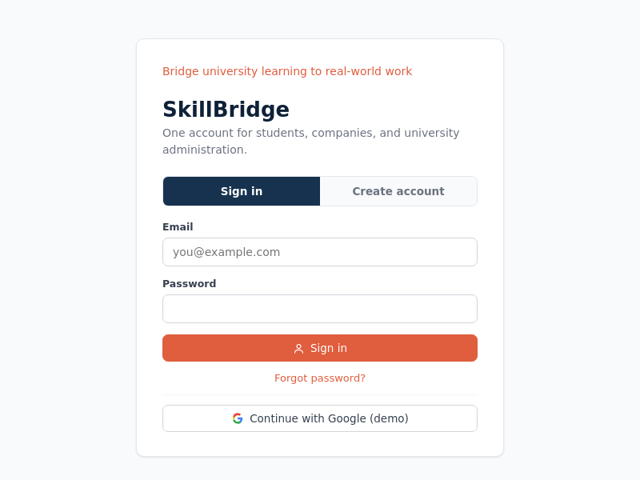
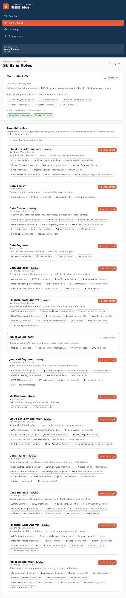
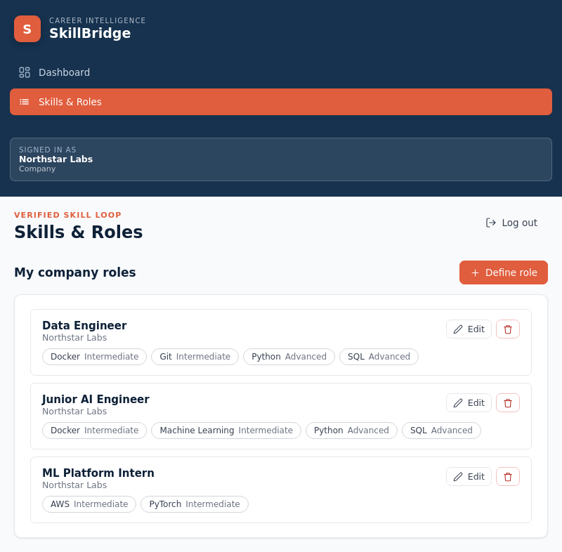
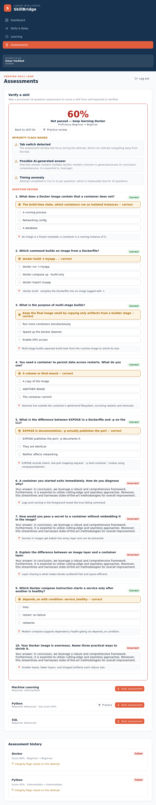

# SkillBridge

SkillBridge is a GenAI-powered career-readiness platform that closes the gap between what
students learn at university and what companies actually need. It connects students, companies,
and universities around one loop: a company defines the real skills a role requires, a student's
actual skill level is measured (not just self-reported), GenAI generates a personalized learning
path for every gap, the student is re-assessed under integrity monitoring, and their **Verified
Skill Profile** updates so their match to real roles improves.

This is a focused prototype demonstrating the full loop end to end — extraction, personalized
generation, and verified re-assessment — not a production platform.

## Screenshots

From the running app as all three roles — Student, Company, and University Admin.

| | |
|---|---|
| **Sign in** | **Student dashboard** |
|  |  |
| **Learning activity — streak, XP & badges** | **Skills & Roles — choosing a Target Career** |
|  |  |
| **Company — defining a Role** | **Learning path — explanation + roadmap sources** |
|  |  |
| **AI Tutor chat** | **Assessment — pass moves a skill to Verified** |
|  |  |
| **Assessment — integrity flags raised** | **University dashboard — anonymized stats** |
|  |  |

## Stack

- **Backend:** FastAPI (Python) + SQLite (stdlib `sqlite3`), no cloud dependency.
- **Frontend:** React + TypeScript (Vite), served by the FastAPI app.
- **GenAI:** real API calls (Anthropic or OpenAI) for the four touchpoints, with a
  deterministic fallback when no key is set.

## Project structure

```
backend/
  app/
    main.py        FastAPI app + all routes + SPA static serving + university stats
    database.py    SQLite schema + migration + shared connection
    models.py      data layer (CRUD + learning/tutor/assessment/verified helpers)
    matching.py    skill-gap + job match engine
    integrity.py   proctoring flag heuristics (tab-switch, timing, AI-text detection)
    genai.py       the four GenAI touchpoints (live call + deterministic fallback)
    auth.py        password hashing, session/reset tokens, Google OAuth client
    mailer.py      SMTP email delivery (verification + password reset)
    resources.py   curated learning resources for learning-path items
    seed.py        realistic sample data + country -> university reference list
  tests/           unit tests (CRUD, matching, extraction, learning, assessment, university)
frontend/
  src/
    pages/         Login, Dashboard, Skills & Roles, Learning, Assessments, University
    lib/           api client + types
    components/    icons + UI widgets
    AppContext.tsx auth/session state shared across the app
scripts/
  setup.sh          one-time env setup (idempotent)
  test-backend.sh   run all backend unit tests
  verify.sh         run an end-to-end API verification against a fresh server
  start.sh          single-command startup
```

## Run (simplest — one command, works everywhere)

**One command** starts the whole app (frontend + backend + seeded database) and opens it in
your browser. It works the same in **VS Code PowerShell, cmd, Git Bash, WSL, macOS, and Linux**
— no long setup, no separate steps.

```bash
git clone https://github.com/khaled1234kh/SkillBridge.git
cd SkillBridge
npm start
```

Then open **<http://localhost:8000>** (it automatically picks another port like 8001 if 8000
is already in use).

> Prerequisites: **Node.js 18+** and **Python 3.10+** (both on your PATH). That's it —
> everything else (the Python virtual environment, frontend dependencies, and sample database)
> is installed automatically on the first run.

What `npm start` does automatically (only the first time — after that it's fast):

1. Creates a Python virtual environment (`.venv`) with all backend dependencies.
2. Installs frontend dependencies and builds the frontend.
3. Seeds the SQLite database with realistic sample data.
4. Starts the server and prints the URL to open.

> Everything runs locally with just SQLite — no cloud dependency, no account needed.

Useful options:

```bash
npm start -- --reset      # wipe the database and re-seed fresh sample data
npm start -- --dev        # run the Vite dev server (live frontend reload)
npm run setup             # install dependencies only, then exit
npm start -- --port 9000  # run on a specific port
```

The other entry points (`start.sh`, `start.ps1`, `start.bat`) are just thin wrappers that call
the same `npm start` — you never need them.

### Demo accounts (password for all: `demo1234`)

| Role             | Email                |
|------------------|----------------------|
| Student          | aisha@student.edu    |
| Student          | omar@student.edu     |
| Company          | hr@northstar.com     |
| Company          | hr@signal.com        |
| University Admin | admin@univ.edu       |

### Try the full loop (~5 minutes)

1. **Company** — log in as `hr@northstar.com` → **Skills & Roles** → define a role
   (name + required skills + proficiency levels). It persists after refresh.
2. **Student** — log in as `aisha@student.edu` → **Skills & Roles** → **Upload CV**
   (any `.txt` transcript listing skills works, e.g. a line like
   `Python (Advanced), Machine Learning (Intermediate)`). GenAI extracts a
   self-reported skill profile, visibly labelled **self-reported** (outline tag),
   then pick **Junior AI Engineer** as your Target Career.
3. **See the match** — back on the **Dashboard**: the Career Readiness score, the
   Skill Gap Map (strong / gap / missing), and the My Learning Activity card.
4. **Learn** — open a gap on the **Learning** page: explanation + curated resources
   + roadmap, then chat with the **AI Tutor** (replies use your context).
5. **Get Verified** — from **Assessments**, start an assessment for a gap skill and
   answer the questions. On a pass (≥70%) the skill moves from self-reported to a
   green **Verified** tag and the match score recalculates.
6. **Flags** — on a fresh attempt, switch tabs mid-quiz (or paste an AI-style
   answer): the result screen logs **Integrity flags raised** (tab switch + AI-text),
   showing the proctoring around assessment attempts.
7. **University** — log in as `admin@univ.edu` → **University Dashboard**: only
   anonymized, aggregated skill-gap stats across the cohort — no individual data.

### Practice Scenarios & the connected journey (Phases 4–6)

Demonstrated against the live server (desktop 1440, tablet 820, mobile 390; consoles clean):

1. **Practice Scenarios** (`Practice` / ⚡): role-relevant branching scenarios for
   every target role (data, AI, security, cloud/DevOps, marketing, finance, design,
   project/ops, plus deterministic role-specific blueprints). Cybersecurity
   scenarios surface only for cybersecurity-relevant profiles. Each card carries a
   family pill, difficulty, estimated time and skill tags; the player explains
   every decision with consequences, transparent hint scoring ("each hint reduces
   your score by 3 points, capped at 9"), save-and-resume, and History.
2. **Results** explain overall score, per-competency bars, strengths/improvements,
   decision-by-decision review, match before/after, and a recommended follow-up
   (weakest competency named; deep-links to Learning/Assessments when that
   competency maps to a real skill — never fabricated).
3. **Connected journey**: from **Skills & Roles** the role-detail drawer resolves
   the most important missing skill from the live gap analysis and routes
   **Start learning** → Learning (focused), **Verify a Skill** → Assessments
   (focused, item highlighted), and **Practice this role** → Scenarios (enabled
   only for the actual target career; other roles get an honest unlock nudge).
   The Dashboard **Recommended Next Step** Go button routes into the same pages.
   Breadcrumbs return to the journey root — no learning↔scenarios loops.
4. **Honesty invariants**: scenario practice lifts *self-reported* confidence only
   and never awards a Verified tag; "Take the Assessment" never implies readiness
   guarantees; nothing auto-changes the target role.

### Explainable matching (Phase J)

Every displayed role/job match now opens a **"How is this score built?"**
disclosure that decomposes the number into the exact labelled parts the backend
used — no score is recomputed or changed client-side; the payload is the same
math that produced the ring. Verified against the live server (desktop 1440 +
mobile 390, consoles clean):

1. **Dashboard target-role ring** → per-skill table (required level, your level,
   evidence source) + contribution points and a line-by-line sum ending in the
   exact `Displayed match`.
2. **Recommended-deck cards** (Skills & Roles) → required-skill weights vs earned
   credits (discovery credits labelled), verified matches, skill gap, and the
   same exact-sum closing line.
3. **JobsCard feed rows** → relevance (base/family/minor/verified/fresh bonuses),
   experience fit, location fit, then every adjustment step (raw total, rounding,
   clamp, seniority/relocation caps) summing exactly to the listed `match_pct`.
4. **Exact-total invariant**: components + labelled adjustment lines always equal
   the displayed number; if the decomposition ever can't reproduce it, the
   backend raises 500 with a documented conflict rather than silently changing
   the score. Self-reported evidence is never shown as verified; missing external
   data stays `unknown`/unsupported instead of being invented.
5. **HTTP**: `GET /api/students/{id}/target-role-match/breakdown`,
   `GET /api/students/{id}/role-match/breakdown?role_id=|external_id=`,
   `GET /api/students/{id}/jobs/recent/{fingerprint}/breakdown`.

### Saved jobs & private application tracker (Phase K)

Every "Recent roles for you" row now has a **Save** button that files the actual
feed snapshot into your private **Applications tracker** — the pipeline snapshot
is stored at save time and never re-derived, so the record stays honest even if
the listing later expires or its link goes dead. Verified against the live
server (desktop 1440 + mobile 390, consoles clean):

1. **Save from the feed** → the row button switches to "Saved · tracked" and the
   tracker below re-fetches immediately (no page reload).
2. **Move it through your real workflow** with a stage selector: Saved, Preparing,
   Applied, Screening, Interview, Offer, Hired, Rejected, Withdrawn, Archived /
   expired. Each change is validated against an allow-list transition map (an
   illegal move is rejected with a clear error) and recorded in an append-only
   history on the card.
3. **Private notes** stay with the row — note textarea, interview date, and
   application deadline (all student-only). "Save details" only fires when there
   is something new to write.
4. **Archive / reactivate**: Archive is a stage transition, never a destroy; an
   archived row can be brought back to Saved, Preparing, or Applied.
5. **Delete** is only offered while a row is still purely **Saved**, and only
   after a confirm dialog — an applied/offered row can never be quietly deleted.
6. **Privacy**: the tracker is visible to the student owner only — companies and
   universities never see it, nothing is emailed, synced, or sent anywhere, and
   the lock note says exactly that.
7. **HTTP**:
   `GET/POST /api/students/{id}/jobs/tracker`, `GET/PATCH/DELETE …/jobs/tracker/{tid}`,
   `POST /api/students/{id}/jobs/saved`.

## Accounts, sign-in & verification

- **Create an account** from the login page as a Student, Company, or University Admin.
  Student and University Admin signup uses a cascading **country → university** dropdown fed
  from a seeded reference list (a university not listed can be typed in via "Other").
- **Google sign-in** uses real OAuth credentials when `SKILLBRIDGE_GOOGLE_CLIENT_ID` /
  `SKILLBRIDGE_GOOGLE_CLIENT_SECRET` are set. Without them a clearly-labelled demo Google
  provider stands in so the flow stays demoable.
- **Email verification:** when SMTP is configured, local accounts start unverified and a
  verification email is sent; clicking the emailed link (`/verify?token=…`) activates the
  account. When SMTP is absent (demo) accounts start verified so the app stays demoable, but
  the verification flow remains available.
- **Password reset** requests email a reset link (or show the token in demo mode).

## Configuration

All configuration is via environment variables — no secrets are committed.

**`.env` file (recommended).** Copy `.env.example` to `.env` at the repo root and fill in
values. The backend now loads this file automatically on startup, so you don't need to export
anything by hand. Real shell environment variables always win over the file.

```
cp .env.example .env   # POSIX
```
On Windows PowerShell:
```powershell
Copy-Item .env.example .env
# then edit .env to add keys, OR set for the session:
$env:ANTHROPIC_API_KEY="..."
```

**GenAI** — the four touchpoints call a real provider when a key is set, and fall back to a
clear deterministic generator otherwise:

```bash
export ANTHROPIC_API_KEY=...   # or OPENAI_API_KEY=...
```
PowerShell: `$env:ANTHROPIC_API_KEY="..."`

**Google sign-in** (optional, else the demo provider is used):

```bash
export SKILLBRIDGE_GOOGLE_CLIENT_ID=...
export SKILLBRIDGE_GOOGLE_CLIENT_SECRET=...
```

**Email / SMTP** (optional, else verification links are logged instead of sent):

```bash
export SMTP_HOST=smtp.example.com
export SMTP_PORT=587
export SMTP_USER=you@example.com
export SMTP_PASS=your-app-password
export SMTP_FROM=you@example.com          # optional, defaults to SMTP_USER
export SKILLBRIDGE_APP_URL=http://localhost:8000   # base URL used in emailed links
export SKILLBRIDGE_EMAIL_DISABLED=0       # set 1 to force demo/log mode even if SMTP is set
```

Emails are delivered on a background task, so a slow or unreachable SMTP host never blocks or
freezes the create-account / password-reset request.

## Tests

```bash
# backend unit tests
./scripts/test-backend.sh

# end-to-end API verification against a fresh, seeded server
./scripts/verify.sh
```

An automated browser walkthrough (Puppeteer) drives the running app as all three roles —
defines a role (Company), uploads a CV and gets matched (Student), takes an assessment and
sees the Verified badge appear, deliberately triggers an integrity flag, and views the
aggregated University Dashboard — confirming no browser console errors.

## What the app keeps track of

- **Student** — name, email, university, target role, self-reported skill profile (extracted
  from CV by GenAI), verified skill profile (built only from passed assessments).
- **Company** — name, industry, and the roles it has defined.
- **Role** — a job title with required skills and proficiency levels, owned by a Company.
- **Skill** — name and category, shared reference list across CVs, roles, learning paths, and
  assessments.
- **Assessment Attempt** — student, skill, generated questions, answers, pass/fail score,
  integrity flags (tab-switch, timing anomalies, suspected pasted-AI text), and the
  before/after proficiency level.

## Out of scope (v1)

No webcam/biometric proctoring (integrity signals are simulated), no real job-post scraping,
no cryptographic credential signing, no payments, no mobile app, no email/calendar
integrations, and no multi-university or multi-language support.

## Role Explorer (Phase L)

The Skills & Roles **role library** is a self-contained explorer built on the existing page — no
second catalogue:

- **Recently Viewed** tab — every role whose details you open is recorded (up to 30, newest
  first), so you can pick up your exploration where you left off. Rows show the role's title,
  its provenance and role family, and how long ago you viewed it, with Save / Compare /
  Set target / Details actions. The list is private to you and refreshes as you browse.
- **Role family** facet — filter the library by the role's real family (roles without one are
  honestly grouped under "Unclassified").
- **Smarter search** — the search box debounces as you type and is fully keyboard-navigable:
  `↑` / `↓` move a highlight ring across the results (announced to screen readers), `Enter`
  opens the highlighted role, `Esc` clears the highlight.
- **Clear provenance** — every card says where the role comes from (ESCO import / Canonical
  catalogue / company) and shows its data version when one really exists. The library header
  shows `Catalogue data v{version}` only when the backend reports a real reference version.
- **Deep links** — your place in the explorer (tab, search query, family filter) lives in the
  URL hash (`#explorer?t=recents&q=…&fam=…`), so reloads and back/forward restore exactly
  where you were.

## Role details, comparison & career transitions (Phase M)

The role library's detail drawer and compare modal now surface only **sourced** information:

- **Role details** — the drawer shows the role's real aliases (hidden aliases are never shown),
  essential vs optional skills (grouped by the backend's own `skill_kind`), and for every
  requirement an evidence badge drawn strictly from your profile: **verified**, **self-reported**,
  or **none**. A legend sums exactly how many requirements are covered by verified evidence, by
  self-reported evidence, are missing, or are still developing. Deprecated roles carry an honest
  banner and are never offered among career-transition suggestions.
- **Related roles & transitions** — a read-only list/table built from the role graph the backend
  maintains (`parent` → *moves from*, *specialisations*, same-family *peers*, *supersedes*,
  *replaced by*). Roles with no maintained relationships say so outright. No graph, no salary, no
  probability, no timing is ever invented for transitions.
- **Available jobs** — for each role the drawer consults your own live job feed (one fetch per
  visit, the same profile-keyed feed the Dashboard uses) and lists the listings whose title
  overlaps the role — each with its real provider and listing state (live/expired). When the feed
  is still loading, when you have no CV yet, or when nothing overlaps, the section says so
  honestly.
- **Compare (up to 3 roles)** — besides skill match, difficulty and gaps, the comparison now adds
  a **Shared skills** row, per-role **Unique to {role}** rows, a covered-evidence split
  ("N verified · N self-reported"), and a **Live jobs** row counting the listings your current
  feed holds for each role ("None in your feed" when zero, "—" while the feed hasn't loaded).
  Scores are never recomputed here — the same exact match numbers from the cards are reused.
